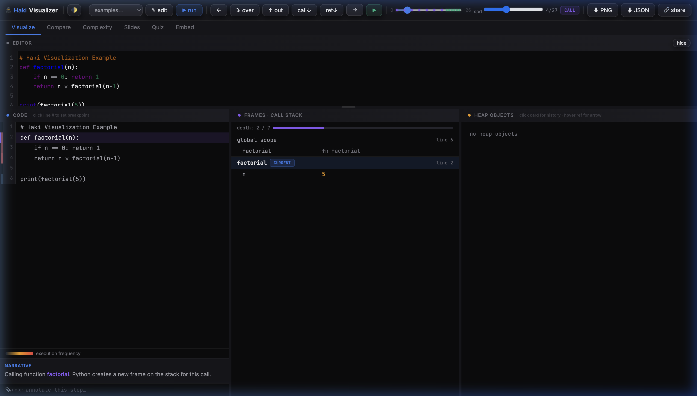

# 🥷 Haki — Python Visualizer

**Haki** is a premium, high-performance Python execution visualizer designed to help developers and students understand complex recursive algorithms, memory management, and performance characteristics — all entirely within the browser.



## ✨ Key Features

### 🔍 Deep Visualization
- **Live Trace**: Step through execution with a granular call stack, frame-by-frame.
- **Heap Inspection**: Interactive heap cards that track object history and mutation across steps.
- **Narrative Overlay**: Automatic natural language explanations of what the code is doing at each step.

### ⚖️ Side-by-Side Comparison
- **Perf Benchmarking**: Compare two versions of an algorithm (e.g., Recursion vs. Iteration).
- **Step Analytics**: See exactly which version is more "lean" in terms of step count and memory depth.
- **Scorecard**: Get a winner badge (e.g., "25% Leaner") based on execution metrics.

### 📈 Complexity Analysis
- **Big-O Inference**: Runs code against varying input sizes (N) and plots the results.
- **Automated Fitting**: Estimates complexity (O(1), O(N), O(N²), etc.) with R² fit quality metrics.

### 🛠 Tools for Education
- **Slides Mode**: Suddenly turn any code trace into a polished presentation.
- **Quiz Mode**: Interactive challenges that test your understanding of variable states.
- **Embeddable**: Generate self-contained snippet to embed Haki visualizations anywhere.

---

## 🚀 Getting Started

### Hosted version
The project is hosted on GitHub Pages. You can access it at:
[https://amit-devb.github.io/haki/](https://amit-devb.github.io/haki/)

### Local Development
Since Haki is a static web application, you can run it simply by opening `index.html` in any modern browser.

1. Clone the repository:
   ```bash
   git clone git@github.com:amit-devb/haki.git
   cd haki
   ```
2. Open `index.html` in your browser.
3. No server setup is required, as the Python runtime (Pyodide) is loaded via CDN.

---

## 🏗 Technology Stack

- **[Pyodide](https://pyodide.org/)**: Python 3.11+ runtime compiled to WebAssembly (WASM).
- **[CodeMirror](https://codemirror.net/)**: High-performance code editing with Python syntax highlighting and autocompletion.
- **Vanilla JS & CSS**: A zero-dependency frontend architecture for maximum speed and control.
- **Flexbox & CSS Grid**: A bespoke, responsive "3-Column" layout designed for productivity.

## 📄 License

Distributed under the MIT License. See `LICENSE` for more information.
